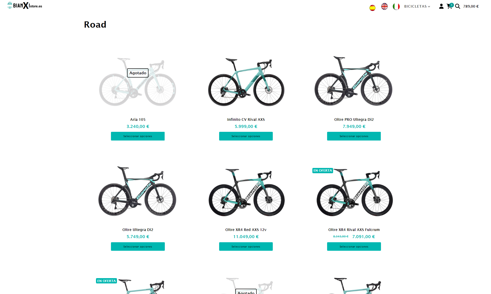
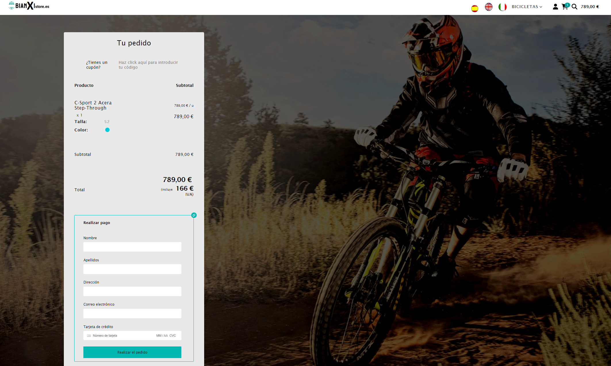

# Bianxi e-commerce

<b>This project is based on the page <a href="https://bianchistore.es">Bianchi Store</a> and mocks the e-commerce system implemented by this page, trying with this to improve my knowledge of React.js and related libraries</b>

 

 

This web application uses on <u><i>frontend</i></u>:

<b><ul>
  <li>React v18.2</li>
  <li>React router v6.4.5 for the route management</li>
  <li>Stripe/js for the payment</li>
  <li>React-uauth/google for google authentication</li>
  <li>Sass for styles</li>
</ul></b>

On the <u><i>backend:</i></u>

<b><ul>

  <li>SpringBoot</li>
  <li>MySql</li>
</ul></b>

👩‍🚀 I hope you enjoy it! 🚀