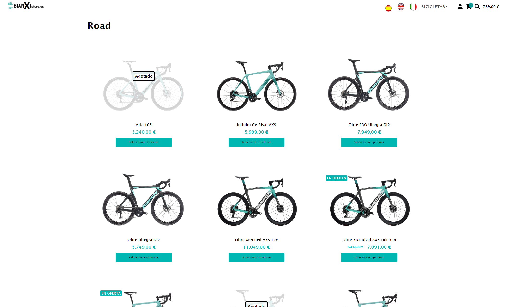
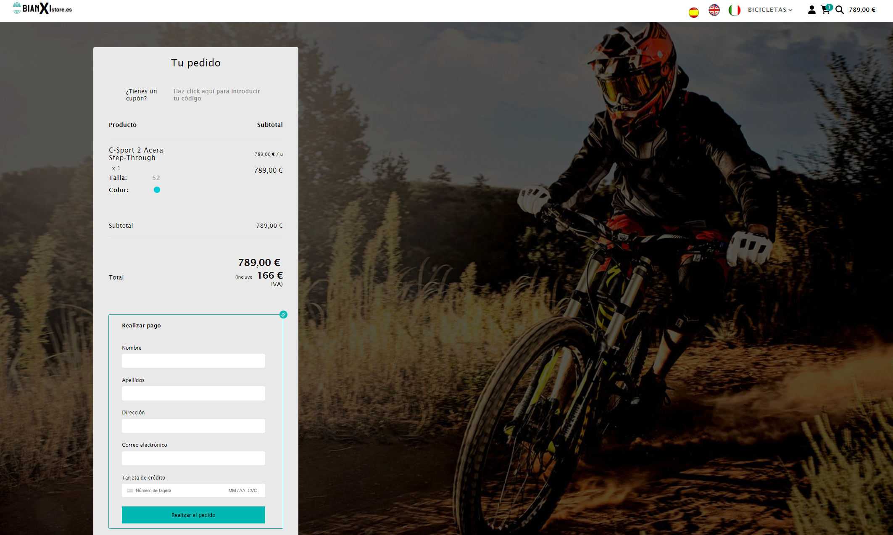

# 🚀 BIANXI API Service

[](https://spring.io/projects/spring-boot)
[](https://hub.docker.com/r/devstoni/bianxi-api)
[](https://en.wikipedia.org/wiki/Hexagonal_architecture_(software))

<b>This project is based on the page <a href="https://bianchistore.es">Bianchi Store</a> and mocks the e-commerce system implemented by this page, trying with this to improve my knowledge of React.js and related libraries</b>

---

<br />




<br />

## 📝 1.1. Introducción
Bianxi API es el backend de la aplicación Bianchi, la cual se compone de una **estructura hexagonal**. Es una API que contiene información para un ecommerce basado en la marca Bianchi de bicicletas profesionales.

## 🛠️ 1.2. Entorno de Desarrollo
El primer paso es arrancar la base de datos con el archivo docker-compose situado en la ruta `/db/migrations/docker-compose-develop.yml`:

```bash
docker-compose up -d
```
## 🛠️ 1.2.1. Variables de Entorno
Variables de entorno requeridas para el arranque:
```
- DB_HOST=containerName
- DB_NAME=name
- DB_PASSWORD=examplePassword
- DB_PORT=3309
- DB_USER=exampleUser
- SERVER_HOST_PORT=8079
- SERVER_PORT=8080
```
---

## 🐘 1.3. Flyway
### 📍 1.3.1. Flyway Location
Se debe tener en cuenta la propiedad `spring.flyway.locations` porque dependiendo del sistema en el que se ejecute la aplicación en desarrollo se deberá configurar de un modo u otro:

#### 🐧 1.3.1.1. Unix
El path quedaría de la siguiente manera:
`/path/to/folder`

#### 🪟 1.3.1.2. Windows
El path quedaría de la siguiente manera:
`./path/to/folder`

---

## 🌿 1.4. Convenciones del Repositorio
Crear rama con la siguiente nomenclatura:
- `feat/add-branch-name`
- `refactor/add-branch-name`
- `test/add-branch-name`
- `chore/add-branch-name`

Los commits seguirán la siguiente convención:
- `feat: this is my commit`
- `internal: commit`
- `chore: commit`

> [!TIP]
> **Flujo:** Abrir Pull Request (se recomienda modo borrador) para verificar la build mediante el workflow de GitHub Actions. Tras el Merge, se recomienda eliminar la rama de trabajo.

---

## 📦 1.4.2. Generar Versión
Para sacar una nueva versión:
1. Desplazarse a **GitHub Actions - Release**.
2. Iniciar el proceso seleccionando **Run Workflow**.

Este proceso generará una nueva versión, subirá la imagen a **Docker Hub** y creará una release en GitHub.

---

## 🐳 1.5. Infrastructura y Despliegue

* **📦 GitOps Repository:** [🚀 `stack/bianxi`](https://github.com/devs-toni/Infrastructure-gitops/tree/main/src/web-server/stacks/bianxi)
* **🐳 Docker Hub:** [Paquete de producción](https://hub.docker.com/repository/docker/devstoni/bianxi-api/general)

La aplicación dispone de repositorio público en Docker Hub, desde donde se va versionando para obtener el paquete en producción.
